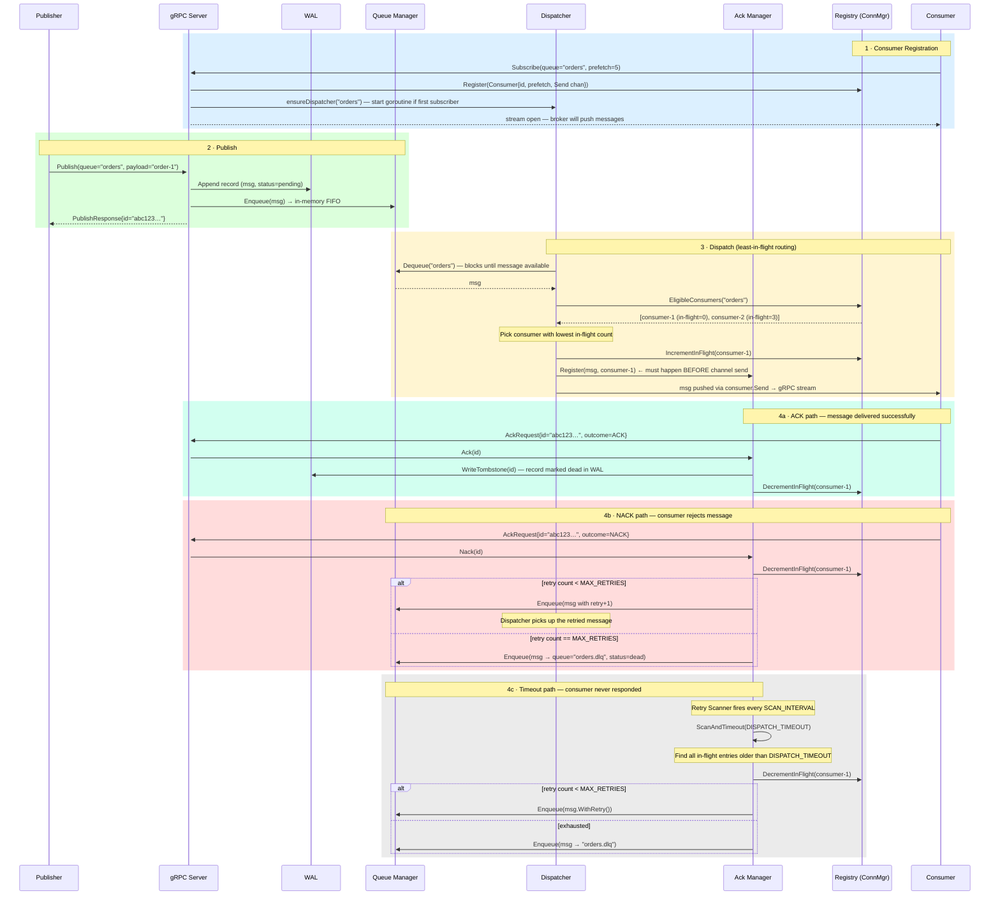
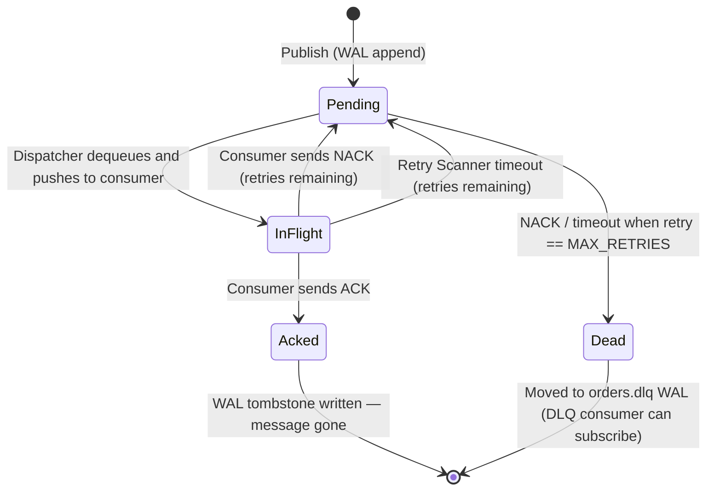

# messager

A push-based message broker built in Go, using gRPC for transport and an append-only Write-Ahead Log (WAL) for durability.

## Architecture

```
Publisher → gRPC Publish RPC → Queue Manager → WAL + In-Memory Topic
                                                       ↓
                                               Dispatcher (per queue)
                                                       ↓
Consumer ← gRPC Subscribe stream ← Connection Manager (prefetch control)
    ↓
ACK/NACK → Ack Manager → WAL tombstone or requeue
                              ↓
                    Retry Scanner (timeout → implicit NACK)
                              ↓
                     DLQ (max retries exceeded)
```


## Message Flow




### Message states



**Key invariants:**
- WAL write always precedes in-memory state change
- In-flight count increments before send, decrements on ACK, NACK, or timeout
- Retry count is part of the message record and persists through WAL replay
- DLQ is a first-class WAL-backed queue, not an in-memory list
- Compaction is always atomic — partial compaction never corrupts the WAL

## Components

| Package | Responsibility |
|---|---|
| `internal/wal` | Append-only WAL writer, reader, compactor. One `.wal` file per queue. CRC32 torn-write detection. |
| `internal/queue` | In-memory FIFO topics backed by the WAL. Replays WAL on startup to restore state. |
| `internal/connmgr` | Consumer registry. Tracks per-consumer in-flight count and prefetch limit. |
| `internal/dispatcher` | Dequeues messages and pushes to the least-loaded eligible consumer. |
| `internal/ackmgr` | Manages the in-flight map. Handles ACK (tombstone + decrement) and NACK (requeue + decrement). |
| `internal/retry` | Background scanner that treats timed-out in-flight messages as implicit NACKs. |
| `internal/api` | gRPC server wiring `Publish` and bidirectional-stream `Subscribe`. |
| `internal/core` | Shared types: `Message`, `MessageID`, delivery status constants. |

## gRPC API

Defined in `proto/broker.proto`.

### `Publish` (unary)

```
rpc Publish(PublishRequest) returns (PublishResponse)
```

Publishes a message to a named queue. Returns the assigned message ID. The broker rejects new publishes once graceful shutdown has begun.

### `Subscribe` (bidirectional stream)

```
rpc Subscribe(stream ConsumerMessage) returns (stream SubscribeEvent)
```

Consumer sends an initial `SubscribeRequest` (queue name + prefetch limit), then receives pushed `Message` events. After processing each message the consumer sends back an `AckRequest` with `ACK` or `NACK`.

## Delivery guarantees

- **At-least-once delivery** — a message is redelivered if the consumer NACKs, disconnects, or fails to ACK within the dispatch timeout.
- **Retry with DLQ** — messages that exceed `MAX_RETRIES` are moved to a dead-letter queue (`<queue>.dlq.wal`) and are not redelivered to the main queue.
- **Crash recovery** — unacknowledged messages are replayed from the WAL on restart with their original retry count preserved.

## Configuration

The broker is configured via environment variables:

| Variable | Default | Description |
|---|---|---|
| `LISTEN_ADDR` | `:50051` | gRPC listen address |
| `WAL_DIR` | `data/wal` | Directory for WAL files |
| `MAX_RETRIES` | `3` | Maximum delivery attempts before DLQ |
| `DISPATCH_TIMEOUT` | `30s` | Time before an unacknowledged in-flight message is NACKed |
| `SCAN_INTERVAL` | `5s` | How often the retry scanner checks for timed-out messages |
| `SHUTDOWN_TIMEOUT` | `15s` | Grace period for draining in-flight messages on shutdown |

## Building

```bash
# Build all binaries
make build

# Run tests (with race detector)
make test

# Regenerate protobuf code (requires protoc + plugins)
make proto

# Tidy dependencies
make tidy
```

## Running

**Start the broker:**

```bash
go run ./cmd/broker
```

**Publish messages:**

```bash
go run ./cmd/publisher \
  -addr localhost:50051 \
  -queue orders \
  -count 20 \
  -payload order \
  -interval 100ms
```

| Flag | Default | Description |
|---|---|---|
| `-addr` | `localhost:50051` | Broker address |
| `-queue` | `orders` | Target queue |
| `-count` | `10` | Number of messages to publish |
| `-payload` | `msg` | Payload prefix; each message becomes `<prefix>-N` |
| `-interval` | `0` | Delay between publishes (e.g. `100ms`) |

**Start a consumer:**

```bash
go run ./cmd/consumer \
  -addr localhost:50051 \
  -queue orders \
  -prefetch 5 \
  -id worker-1
```

| Flag | Default | Description |
|---|---|---|
| `-addr` | `localhost:50051` | Broker address |
| `-queue` | `orders` | Queue to subscribe to |
| `-prefetch` | `5` | Max in-flight messages for this consumer |
| `-delay` | `0` | Simulated processing time per message (e.g. `100ms`) |
| `-outcome` | `ack` | Reply with `ack` or `nack` for every message |
| `-id` | `consumer` | Label shown in log output |
| `-count` | `0` | Exit after receiving N messages (0 = run forever) |

**Example: two competing consumers**

```bash
# Terminal 1 — fast consumer
go run ./cmd/consumer -queue orders -prefetch 10 -id fast

# Terminal 2 — slow consumer
go run ./cmd/consumer -queue orders -prefetch 2 -delay 200ms -id slow

# Terminal 3 — publish
go run ./cmd/publisher -queue orders -count 50
```

The dispatcher routes messages to the consumer with the fewest in-flight messages, so `fast` will receive proportionally more load.

## WAL format

Each record in a `.wal` file is:

```
[4-byte magic] [4-byte length] [N-byte protobuf payload] [4-byte CRC32]
```

A tombstone record uses the same envelope with a tombstone flag set in the payload. The reader stops at the first CRC mismatch (torn write boundary). Compaction rewrites the file atomically, dropping all tombstoned records.

## Requirements

- Go 1.22+
- `protoc` + `protoc-gen-go` + `protoc-gen-go-grpc` (only needed to regenerate proto code)
